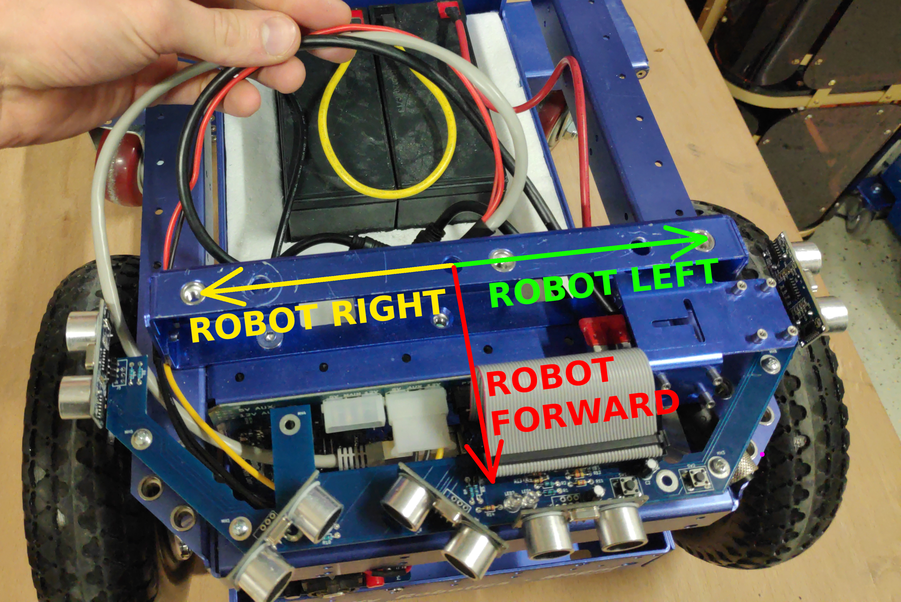
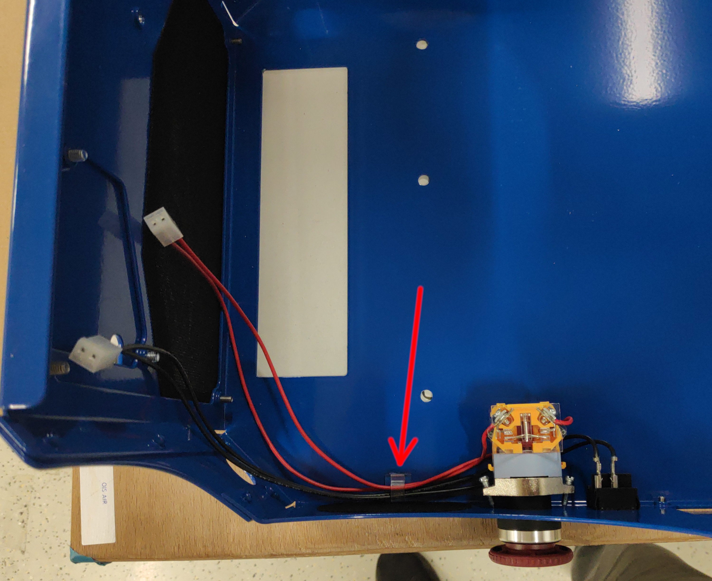
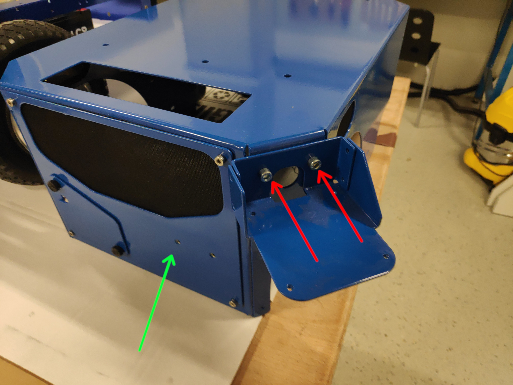
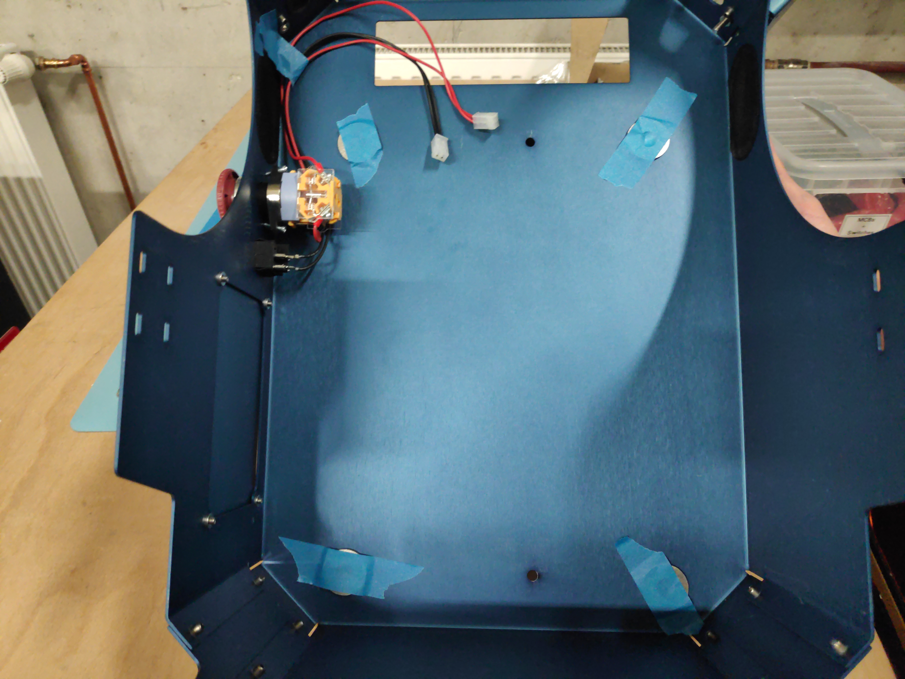
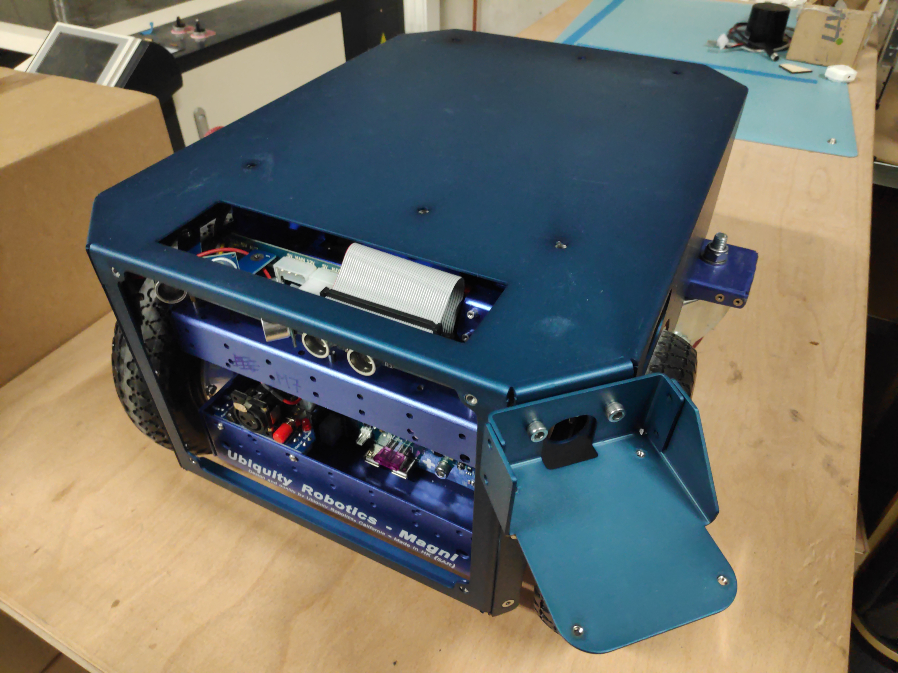
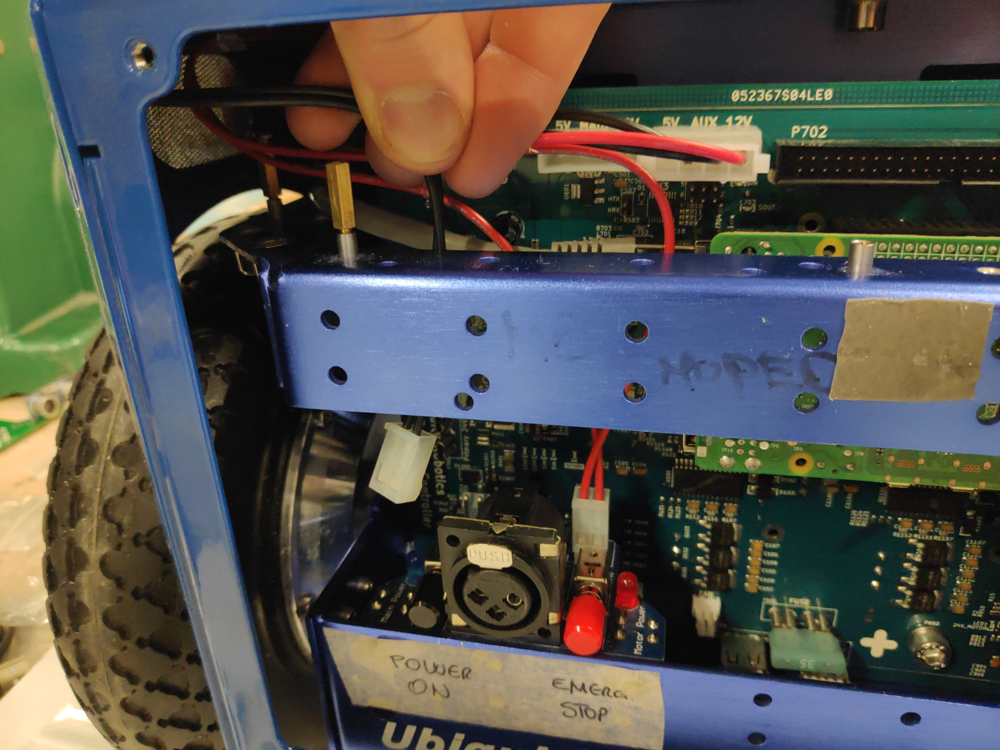
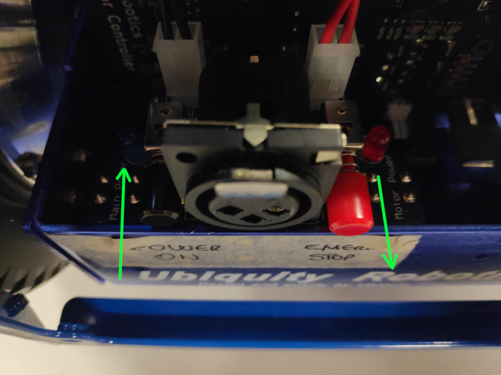
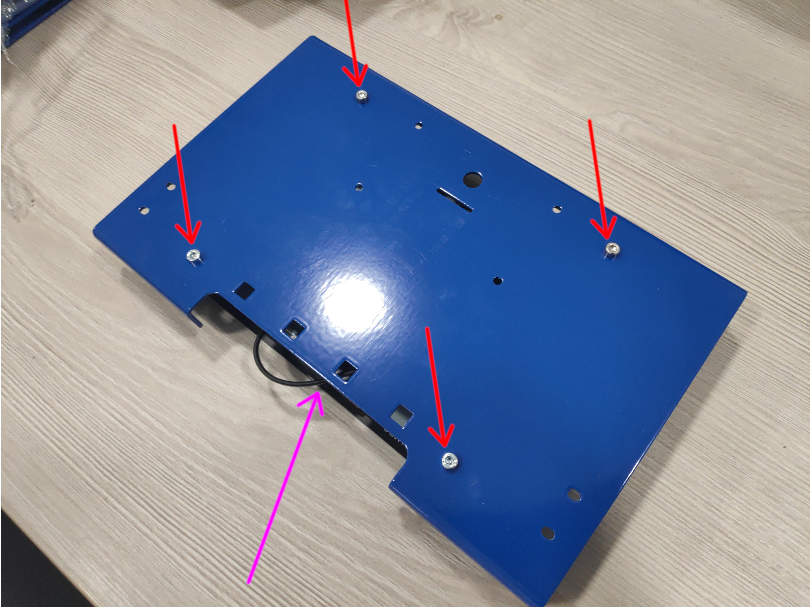
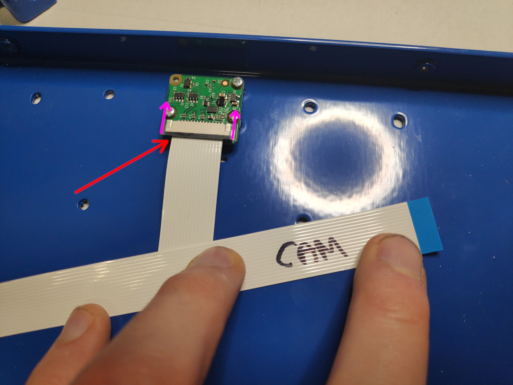

#### &uarr;[top](https://ubiquityrobotics.github.io/ConveyorBot_learn/)

## Shell and Tower assembly instructions

### Before you begin: 

1. It is assumed that you have an overview understanding of Magni base robot and its parts (Pi camera, Raspberry Pi, MCB, Swithcboard, Batteries). If that is not so, please read about it [here](https://learn.ubiquityrobotics.com/) under "High Level Overviews" and "Quick Start".

1. It is assumed that Magni base robot is already unboxed and assembled following the instructions found [here](https://learn.ubiquityrobotics.com/unboxing). The sonarboard also has to be mounted mounted as described in the instructions [here](https://learn.ubiquityrobotics.com/sonar_sensors)

1. **!!! ALWAYS DISCONNECT THE CABLE FROM THE BATTERIES BEFORE DOING ANYTHING WITH ELECTRONICS !!!** The most important thing to note, is that you always have to have the batteries physically disconnected, while you are doing anything with the cables or electronics to prevent any short circuits to the main PCB board. Turning off the robot with the provided main switches is not enough. **Failing to do this can result in injuries and/or fried electronics!**

1. If the Raspberry PI has a micro SD card mounted – avoid powering it on and off too many times just by cutting off the power. That can lead to microSD card corruption. Always try to either use touchscreen or an SSH connection to shut it down and then cut the power.
### Assembly process Video

Here are two videos of how assembly looks like so you know what to expect. All details that are not shown in the videos can be found further in the instructions.
- [Video 1](https://www.youtube.com/watch?v=RDe5XLQTHwM)
- [Video 2](https://www.youtube.com/watch?v=O-YKXxbponM)

## Full BOM of the Conveyorbot (Without base Magni)
### Bolt BOM
  - 3x Grommet 20mm (black rubber to cover lidar holes with)
  - 4x 	M6 x 2-2.5mm thick washers -  temporary replacement for Shell Distancers (2-2.5mm thickness whichever is available)
  - 4x	M3x5mm Cap Socket
  - 12x	M3x15mm Cap Socket
  - 4x	M3x8mm Cap Socket
  - 8x	M4x8mm Cap Socket
  - 2x	M4x8-10mm Thumb Screw (8 or 10 mm whichever is available)
  - 12x	M5x15mm Cap Socket
  - 10x	M5x15mm Button Socket
  - 6x	M6x15mm Cap Socket
### Electrical BOM
  - 1x Touchscreen
  - 1x Emergency switch custom cable (red wires)
  - 1x Power switch custom cable (black wires)
  - 1x Black Shell Power switch
  - 1x USB micro cable 1m
  - 2x Flat cable 1m
  - 1x Adhesive Cable clip
### Mechanical Parts BOM
1. 1x Shell
2. 1x Lidar Mount
3. 1x Touchscreen Back Cover
4. 1x Tower Angle Front
5. 1x Touchscreen Front Cover
6. 1x Top Shelf Holder
7. 1x Tower Angle Bottom
8. 2x Shelves
9. 1x Front Shell Cover
10. 1x Front Charger Cover
11. 1x Battery Shell Cover
12. 2x Touchscreen Holders
13. 2x Shell Distancers (if these are not found in the package, you should have gotten extra washers in the SHELL bolts bag)

Screw types used and their names in the instructions:

What tools will be needed to assemble the Breadcrumb together:
 - small screwdriver (for M2 camera bolts)
 - big screwdriver (for mounting emergency switch)
 - M3 Allen key
 - M5 Allen key
 - M6 Allen key 
 - Paper tape

---

### Assembly process

1. Remove the top plate and the Sonar board from the robot by unscrewing it and disconnecting the flat cable. Also unscrew the camera from its holder (**4xM2 screws**) – **the camera is going to be remounted onto the Tower later**. Here if the picture of how the robot looks without the sonars and camera. 
   
    Note the batteries orientation - they need to have terminals at the back of the robot as shown (This is to ensure easy reconnecting of main battery cable after the shell is mounted).

    

2. Take lidar cable and route the MOLEX and ethernet as shown

    

3. Connect the MOLEX power connector to the MCB (like shown with green arrow). Do not plug it into the connector with the red cross. Next plug the LAN connector into the RPI LAN port (purple). Notice also that the other end of the LIDAR cable is routed from battery compartment through the spacer hole (yellow arrow).

    

    
    
    Here we are going to mount the lidar on LEFT side from the robots perspective, but there are other lidar positions available - [see picture](lidar_mounts2.png). If another position is preferred, please route the lidar cables accordingly.

    

    Lidar connector needs to be guided from the battery compartment **through** the spacer hole (purple arrow) under the camera mount. It needs to come out **over** the sonar board (green arrow). Pull the cable out **only a short amount** like shown (stop at red line).

    

4. Now prepare the shell by mounting the two shell switches. Red ESTOP button is assembled from two separate pieces. To install, first disassemble it by turning red and black "mushroom" part counter-clockwise and pulling it apart. Put the "mushroom" part through the hole in the shell like shown.

    

    Assemble the estop button by pushing it lightly inwards and turn it clockwise (This part should go together easily without force). Note that the shell does not have screw holes for mounting the ESTOP button, the screws just push on the shell to keep the button in place.

    
        
    Plug the black cables into the power switch and red ones into the EMG switch. Use the self-adhesive cable clip to fix the cables in place (red arrow). If the cable clip is not already attached it should be found in one of the zip bags.

    

5. Mount the LIDAR holder using **2xM5x15mm Cap Socket** screws from SHELL zip bag (red arrows). Also unscrew the front plate and save the 4 screws that hold it in place (green arrow).

    

6. Turn the shell and use some paper tape to glue the 4 washers from zip bag SHELL over the corner holes - make sure the screws from the top will be able to go through both the shell hole and the washer. **This is a temporary solution to have the shell mounted higher so the sonars are not obstructed by the shell. In the future these washers are going to be replaced by a dedicated part.**

    

7. Put the shell on the robot. Be careful that you don't bend the sonars when putting the shell onto the robot (red lines). We suggest first putting the front part over the sonars like shown. 

    

    Also use this chance to route the red and black cables through the sonar hole (green arrow). The robot with shell fully mounted should look like shown. Shell should rest fully on the magni with NO cables in between them (lidar cable and EMG switch cables can be problematic).

    
    <!--  -->

8. Connect the shell switches into the switch board – emergency button behind the red switch and square power shell switch behind the black one.

    

    Make sure that the black button here is pressed in while the red one is released.

    

9. Connect the LIDAR by pulling the lidar connector through the hole just a bit and then screwing it onto the dedicated thread.

    

10. Screw the LIDAR with **4xM3x8mm Cap Socket** screws from the SHELL zip bag. You can place two screws before moving the lidar into position for easier mounting.

    

    

***

### Tower assembly

1. Some touchscreen parts come pre-assembled and some cables already attached and tucked inside the assembly (purple arrow). First unscrew and save **4xM3x15mm screws** (red arrows)

    

2. Attach the camera with **4xM2 screws** that it came attached to the robot with. If the bolt is hard to screw, simply tighten and un-tighten it a couple of times until it gets easier. After that attach the flat cable to the camera.

    

    Notice how the blue sides of the flat cable connectors are turned. Please also make extra sure, that the flat cable connectors of BOTH camera and touchscreen are well connected and as fully pressed into the connectors as possible (red arrow) with the connector lock pressed in (purple arrows).

    

    Also use a sharpie or some other tool to indicate the camera flat cable to be able to distinguish the cables later.
 

3. A lot of times the flat cable connections being not adequate or faulty is the reason screen or camera don't work. You can test this connections (by following steps in the [Connecting The Tower To Shell](#connecting-the-tower-to-shell) Section below) by connecting to RPi and powering it up to see if the screen and camera are working - to avoid having to reassemble everything up again later.

4. Now use the **4xM3x15mm Cap Socket screws** from step 1. to mount the screen into the back plate. You can use a zip tie to mount the USB cable into the housing using the square holes.

    

5. Use **6xM5x15mm Cap Socket screws** from TOWER zip bag to put the two angle parts of the tower together. 

    The holes in two parts might not always fully align if the parts are just out of the box. If that is the case first screw the front two screws tightly and then use a bit of force to also screw the others. The parts should fit together with a bit of effort. 

    

6. Use **4xM3x15mm Cap Socket screws** from SCREEN zip bag to mount the screen assembly onto the angle assembly. At this point you can also unglue the protective sticker from the touchscreen if you wish.

    

7.  As the last part of the tower assembly, mount the front panel using **4xM3x15mm Cap Socket screws** from SCREEN zip bag.

    
    
8.  The cables can also be inserted into cable guides. 

    

***

### Connecting The Tower To Shell

1. If you haven't already, burn the latest Conveyorbot image onto a MicroSD card. You do that by first downloading the latest Conveyorbot image here(TODO add link). Then take the MicroSD card out of Raspberry Pi and insert it into your computer. Flash the downloaded image onto the microSD card using either GNOME Disks tool, [Etcher](https://www.balena.io/etcher/) or [Win32DiskImager](https://win32diskimager.download/). 

2. Put the assembled tower onto the robot. Be careful with the fragile flat cables.

    

3. If you haven't already, please **MAKE SURE THE BATTERIES ARE DISCONNECTED FROM THE ROBOT** before continuing. Connect the two flat cables to Raspberry Pi (RPi). The screen flat cable connector is at the back and for camera in the middle of RPi. Notice that the blue part of the flat cable connector is pointed backward (touching black latch) for the screen cable and to the front for the camera cable. Make sure that these cables are pushed into the RPI as far as possible – a lot of people have problems when these connectors are not properly connected.

    

    

4. Connect the RPI back into the MCB board. Make very sure that the RPI pins are not off by 1 pin in any direction with respect to the MCB connector! 

    

5. Connect and fold the USB cable

    

6.  Before screwing the rest of the robot, try powering it up, to see if the screen and the camera work. You can do that by 
    
    1.) first make sure emergency switch is pressed inside and square switch is switched off, 
    
    2.) connecting the battery cable connector through the battery opening (green square), 
    
    3.) switching on the square switch on the shell. 
    
    The screen should be lighting up and after the robot boots you should see camera stream by clicking the Screen icon on the Conveyorbot app. The camera stream might not show up immediately - please wait at least until the battery icon shows some battery charge. If anything does not work, the fault, most probably is the bad connections of the flat cables – recheck those. Turn off the robot and disconnect the RED battery connector before continuing.

    

    

    If everything went well touch the camera stream to exit and shutdown the RPI, wait 20 seconds for RPI to properly shutdown and then again disconnect the red battery cable before proceeding.

7.  Use **4xM4x8mm Cap Socket screws** which you unscrewed before to mount the front plate back.

    

8.  Mount the charging port cover if its not mounted already.

    

9.  Use **6xM6x15mm Cap Socket screws** from TOWER zip bag to mount the tower and the shell to the robot. 

    

    You can use **4xM5x15mm Cap Socket screws** to mount the angle shelf holder and **10xM5x15mm button socket screws** to mount the two shelves.

    

10. Mount black grommets into the empty LIDAR connector holes. Side point: more LIDAR positions are available. All those can be used, but then an easy parameter change needs to be done in the system of the robot.

    

    

11. Wherever you mounted your lidar, make sure the system knows about its location on the robot by SSH-ing into the robot and then editing the following folder
 
        sudo nano /etc/ubiquity/robot.yaml
    
    And the lidar position should be changed to the proper one. In this tutorial the lidar was mounted on the left side of the shell. Position of the camera should be downward

        lidar: {'position' : 'shell_left'} # possible: none, top_plate, shell_left, shell_right, shell_center, tower_center

12. You can now reconnect the battery, power up the robot and begin using it. Remember to every time in the future you need to reconnect something first disconnect the red battery connector. The Conveyorbot assembly is now complete.